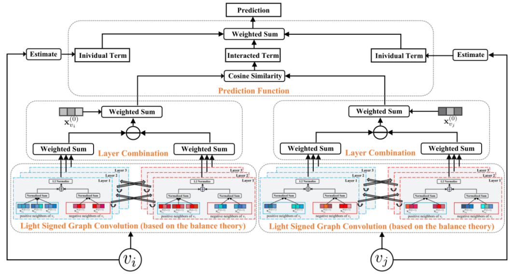

# Unofficial Implementation of LightSGCN

## Overview

- This is an unofficial implementation of LightSGCN

LightSGCN: Powering Signed Graph Convolution Network for
Link Sign Prediction with Simplified Architecture Design



## Requirements

- Please refer to [pytorch](https://pytorch.org/get-started/previous-versions/) for the detailed installation instructions.

- Please run after that

```
pip install -r requirements.txt
```

## Train & Inference

```
python main.py
```

## Tips

- Dataset Bit.OTC is set default